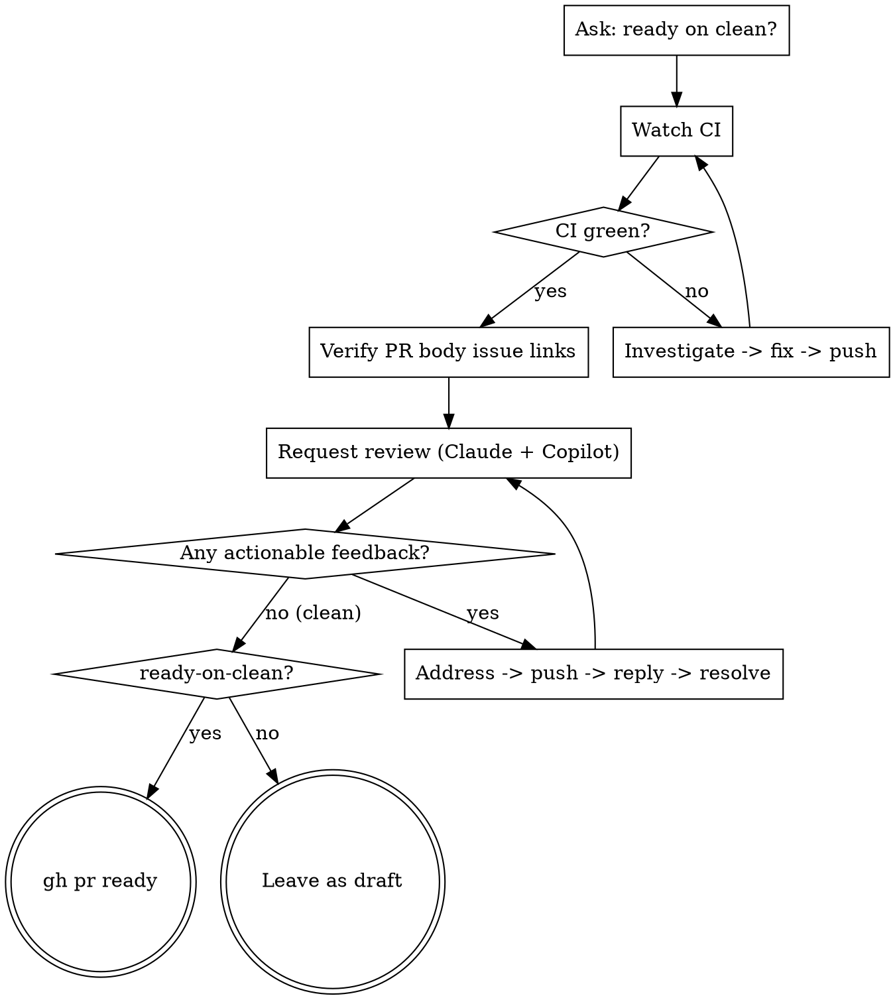

# pr-to-ready

Drive a draft PR by looping until CI passes and the review is clean, then either flip it to **ready** or leave it as **draft**, per the user's up-front choice.

Precondition: a draft PR tied to the target branch already exists. If not, create one first with `gh pr create --draft`.

## Step 0: Ask whether to mark ready on clean

Before starting the loop, ask the user: once CI is green and review feedback is clean, should this skill run `gh pr ready` (ready) or leave the PR as draft (draft)? Record the answer as the **ready-on-clean** flag — fixed for the rest of the run, not re-asked mid-loop. Step 3 branches on this flag.

## Overall flow



## Orchestration model (subagents)

Run this skill as an **orchestrator**. The main loop owns control flow, all decisions, and every state-mutating action; it delegates only self-contained, context-heavy work to subagents. The steps form a dependency chain (a loop), so they run **sequentially** — do not try to run different steps in parallel. Parallelism exists at exactly one point: evaluating independent review findings (2-3).

**Keep in the main loop — never delegate:**
- clean judgment & stop conditions (Step 2 stop conditions)
- code fixes that touch the worktree, and `git commit` / `git push`
- `gh pr comment`, thread replies, thread resolve, `gh pr ready`

**Delegate to a subagent** (it returns findings only, keeping the orchestrator's context lean; each is detailed in its step):
- **CI-failure diagnosis** (Step 1).
- **Review-comment collection** (Step 2-3).
- **Per-finding evaluation, fan-out** (Step 2-3) — one subagent per finding, launched together; genuine parallelism, since findings are independent.

Subagents only investigate and propose (read-only, advisory, no worktree); the orchestrator applies the change, commits, and pushes.

## Making fixes

Every fix in this loop — for a CI failure (Step 1) or accepted review feedback (Step 2-3) — is an ordinary code change: make it by following the core workflow (implement → verify → simplify → self-review) in the shared AI guidelines. Do **not** re-enter that workflow's completion gate: the gate ends by handing off to this skill, so re-entering it from here would loop. This skill's own loop is the PR-phase completion path.

## Step 1: Get CI clean

1. Watch with `gh pr checks <PR> --watch`. If every check passes, go to Step 2.
2. On any failure:
   - Identify the failed run: `gh run list --branch <branch> --limit 5`
   - **Delegate diagnosis to a subagent**: give it `<run-id>` and have it run `gh run view <run-id> --log-failed`, apply **superpowers:systematic-debugging**, and return *only* the root cause + a concrete fix plan (not the raw logs). This keeps the log dump out of the orchestrator's context.
   - Apply the fix in the orchestrator, following the core workflow (see *Making fixes* above).
   - commit → push (follow the git rules in the shared AI guidelines; never push directly to master/main)
   - Go back to 1.

**Clean = every check in `gh pr checks` passes.** If even one is fail/pending, keep looping.

## Step 2: Request review, then loop on feedback

Request review from **both Claude and Copilot** when both are available — they catch different things (Copilot catches bugs Claude misses). Skip whichever isn't available; if neither is, still run 2-0 (the PR body is worth verifying regardless of reviewers), then skip the request/wait (2-1, 2-2, 2-3) and go to Step 3.

### 2-0. Verify PR body issue links

Before requesting reviewers, verify that every issue link in the PR body points to the intended repository. This matters because a bare `#NNN` always resolves in the PR's repository, but the target issue may live in a different repository.

1. Read the PR body and target repository:
   ```bash
   gh pr view <PR> --json body,baseRepository
   ```
2. Inspect every issue reference in the body, especially references using closing keywords (`resolves`, `fixes`, `closes`). For each reference, determine the repository GitHub will link to:
   - Bare `#NNN` resolves to the PR repository from `baseRepository`.
   - Fully qualified `owner/repo#NNN` resolves to that explicit repository.
3. Verify the resolved issue is the intended issue:
   ```bash
   gh issue view <number> --repo <owner/repo> --json url,title,state
   ```
   Compare the resolved repository and issue title with the task context, branch name, commit messages, PR title/body, or linked planning issue. If the intended issue repository is ambiguous, ask the user before requesting review.
4. If any issue link points to the wrong repository, update the PR body before continuing:
   - Same-repository issue: bare `#NNN` is allowed.
   - Cross-repository issue: use the fully qualified `owner/repo#NNN` form.
   - If the PR body says it resolves an issue, keep the closing keyword even for cross-repo targets, e.g. `resolves owner/repo#NNN`.
   - Use `gh pr edit <PR> --body-file <file>` or equivalent to apply the corrected body.

### 2-1. Request the reviewers

- **Claude**: check for an `@claude` trigger in the repo's workflows.
  ```bash
  grep -rl '@claude' .github/workflows/ 2>/dev/null || true
  ```
  If found, post a request comment. Write it in **standard Japanese** with a short "特に見てほしいポイント" list; on a re-request after a new push, include the current HEAD SHA so the review targets the latest state:
  ```bash
  gh pr comment <PR> --body "@claude このPRのレビューをお願いします🙏

  特に見てほしいポイント:
  - <観点1>
  - <観点2>"
  ```
- **Copilot**: try the reviewer flag first; if it fails with `Could not resolve user with login 'copilot'`, that means the flag syntax doesn't resolve here — **do not give up**, fall back to the REST endpoint (the bot IS reachable):
  ```bash
  gh pr edit <PR> --add-reviewer "@copilot" \
    || gh api --method POST "repos/<owner>/<repo>/pulls/<PR>/requested_reviewers" \
         -f "reviewers[]=copilot-pull-request-reviewer[bot]"
  ```
  Only treat it as "Copilot unavailable" if BOTH forms fail.

### 2-2. Wait for the review (bound the wait)

- **Claude**: only do this if 2-1 found an `@claude` workflow and posted a request comment. Tie completion to the workflow run, don't guess from comment counts. Find the run the request triggered on this branch, then block on it:
  ```bash
  wf=$(basename "$({ grep -rl '@claude' .github/workflows/ 2>/dev/null || true; } | head -1)")
  if [ -z "$wf" ]; then
    echo "no @claude workflow found — skip the Claude wait"
  else
    gh run list --workflow="$wf" --branch <branch> --limit 5 --json databaseId,status,headSha,conclusion
    gh run watch <run-id> --exit-status   # blocks until the run finishes
  fi
  ```
  Then fetch the new comments it left.
- **Copilot**: poll `gh pr view <PR> --json reviews` and **filter by author login** (see the login-variance note below) — wait for a *new* Copilot review submitted after your latest push. **Do not wait for `APPROVED`**: Copilot commonly only ever returns `COMMENTED`, so `APPROVED` may never arrive.
- **Always bound the poll** with an iteration cap + explicit bail-out (e.g. cap ~10–30 min). On timeout, stop and tell the user rather than looping forever.

**Login variance**: bot logins differ across surfaces — Copilot appears as `Copilot` and `copilot-pull-request-reviewer[bot]`; Claude as lowercase `claude`. Match on a substring and confirm the author login; don't attribute by timestamp alone (a human commenting in the same window can be misattributed).

### 2-3. Evaluate and address feedback

**Collect (subagent).** Delegate comment collection to a subagent: it gathers every reviewer comment left after your latest push (Claude + Copilot + any human), dedupes, and returns a structured list of actionable findings — each with `file:line`, the thread/comment id, and a one-line summary. This keeps the raw review text out of the orchestrator.

**Evaluate (fan-out subagents).** Launch **one subagent per finding in a single message** so they run concurrently — findings are independent. Each applies **superpowers:receiving-code-review** to its single finding and returns a verdict:
- `accept` — change warranted, with the proposed fix
- `reject` — push back, with the technical reason
- `needs-user` — genuinely unclear; surface to the user

**Apply (orchestrator, sequential — these mutate shared state):**

1. For each `accept`, fix the code where a change is warranted, following the core workflow (see *Making fixes* above).
2. commit → push
3. Reply to each thread (including `reject` threads — explain the pushback). **Standard Japanese only — never Kansai dialect** (a frank, casual tone is fine, but dialect has slipped in before). **Never put `@claude` in a reply or closing comment** — it re-triggers the review workflow. For the reply mechanism see the "GitHub Thread Replies" section of receiving-code-review (`gh api repos/{owner}/{repo}/pulls/{pr}/comments/{id}/replies`).
4. Resolve the threads — batch all threads from this round in one call (script below takes multiple comment IDs).
5. Go back to 2-1 and re-request both reviewers.

List unresolved threads / resolve one or more at once. `<skill-dir>` is wherever your runtime installed this skill (e.g. `~/.claude/skills/pr-to-ready`, `~/.agents/skills/pr-to-ready`):
```bash
<skill-dir>/scripts/list-unresolved-threads.sh <owner> <repo> <PR>
<skill-dir>/scripts/resolve-thread.sh <owner> <repo> <PR> <comment-id> [comment-id...]
```
(GitHub's REST API has no resolve endpoint, so these wrap the GraphQL mutation.)

### Clean judgment & stop conditions

**Clean =**
- Claude leaves only "looks good" / "LGTM"-equivalent comments with no outstanding actionable feedback, AND
- Copilot's latest round produced **no new actionable comments** (not "APPROVED") and there are **zero unresolved threads**.

Treat human reviewer comments the same way (see receiving-code-review).

**Stop the loop when ANY of these holds** (otherwise keep looping):
1. Clean per above.
2. **LGTM-equivalent twice in a row** — even if each round keeps surfacing *fresh optional nits*, once you've gotten two consecutive rounds with no must-fix feedback, stop; endless optional-nit chasing is not required for ready.
3. **Same feedback survives 3+ rounds** of fixes without resolving → stop and ask the user.

## Step 3: Finish, per the ready-on-clean flag

Once the review is clean (or no reviewer was available), branch on the flag recorded in Step 0:

- **ready-on-clean = yes**: take it out of draft.
  ```bash
  gh pr ready <PR>
  ```
  **Note on approval vs LGTM**: Claude's ✅ "LGTM" is a *comment*, not a formal GitHub approval — `reviewDecision` can stay `REVIEW_REQUIRED`. If the repo has branch protection requiring an approving review, un-drafting won't unblock merge; flag this to the user (a human approver may be needed).
- **ready-on-clean = no**: leave the PR as draft. Do not run `gh pr ready`. Report to the user that CI and review are clean and the PR is left as draft per their earlier choice.
