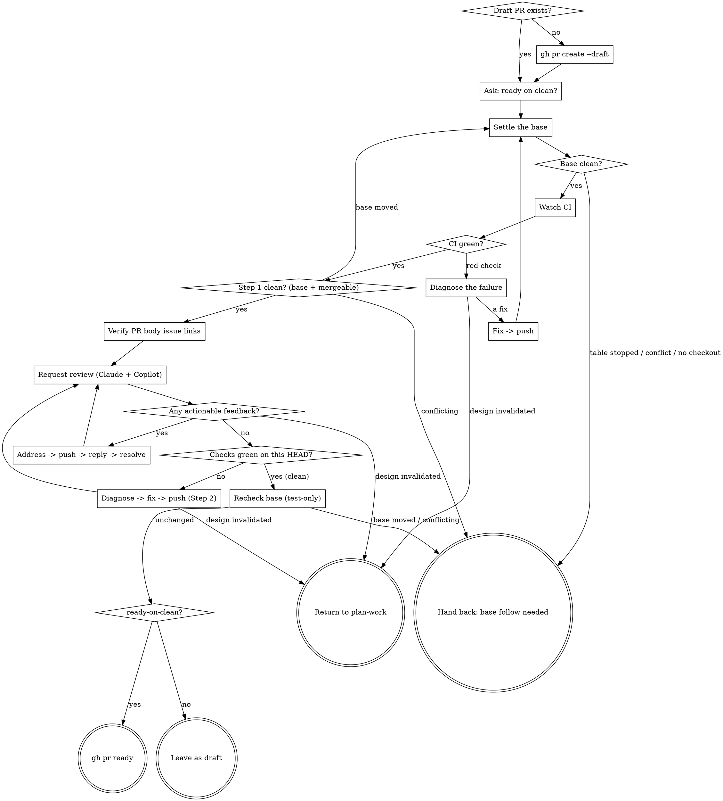

# pr-to-ready

Take a branch of verified commits to a reviewed PR: open the draft PR if it isn't there yet, then loop until CI passes and the review is clean, and finally either flip it to **ready** or leave it as **draft**, per the user's up-front choice.

Precondition: a branch whose commits are already verified — in the Change workflow, `implement-work` hands one over after its completion gate comes back clean — and whose ref exists **on the remote**. An unpushed branch is not a blocker: push it (`git push -u origin <branch>`) rather than stopping. Step 0-1 performs this check once `<branch>` is bound. A PR need not exist yet; this skill owns creating it.

## Step 0: Set up the run

Two things, before the loop starts.

### 0-1. Create the draft PR if none exists

Bind `<branch>` before anything below uses it.

**The primary source is the caller's explicit input**: `implement-work` hands off a named branch, and a user invoking this skill directly names one — take that name as given.

**Reading the current branch is only the fallback**, for a session handed no name:

```bash
git branch --show-current      # empty output = detached HEAD
```

Tested by **output emptiness, not exit status** — it exits 0 and prints nothing on a detached HEAD. **Two answers from the fallback are refusals, not results**: empty output, and the default branch. Stop and ask which branch to take to a PR rather than proceeding.

Recognizing the default branch takes a command of its own. Three rungs, in order — `symbolic-ref`, then `gh repo view`, then ask — with flags suited to this comparison, which needs a bare branch name:

```bash
git symbolic-ref --short refs/remotes/origin/HEAD          # exit 0 prints origin/<default>
gh repo view --json defaultBranchRef --jq '.defaultBranchRef.name'
```

`symbolic-ref` exits 0 and prints `origin/<default>` — strip the `origin/` prefix before comparing it with `<branch>`. A non-zero exit means the remote HEAD is not set in this checkout, **not** that there is no default branch: fall to `gh repo view`, and if that fails too, ask.

Once `<branch>` is bound, check it exists on the remote:

```bash
git ls-remote --exit-code --heads origin <branch>   # 0 = present, 2 = absent, 128 = failure
```

Exit 0 → go on. Exit 128 is a network or auth failure — surface it and stop. Exit 2 has two remedies, depending on whether a local ref exists:

```bash
git show-ref --verify --quiet refs/heads/<branch>   # 0 = local ref exists, 1 = it does not
```

Exit 0 → push it (`git push -u origin <branch>`) and go on, stopping and reporting if the push itself exits non-zero. Exit 1 → **stop and report**: the branch named exists neither in this checkout nor on the remote. Don't create one here.

Ask whether a PR is already tied to the branch with `gh pr list --head <branch>`, **not `gh pr view <branch>`**. The reason for that choice, and for how every `gh` result below is tested, is in `<skill-dir>/references/gh-mechanics.md` — `<skill-dir>` being wherever your runtime installed this skill (e.g. `~/.claude/skills/pr-to-ready`, `~/.agents/skills/pr-to-ready`):

```bash
gh pr list --head <branch> --json number,isDraft   # non-empty = a PR exists, note its isDraft; [] = none
```

Test it by **output and exit status together**: exit 0 with `[]` is the only thing that means "no PR", and a non-zero exit is "couldn't tell" rather than "none" — stop on it.

Create only when the list comes back empty — and settle the base first, because three of its outcomes stop before anything is created.

#### Resolving the base

**Step 1 re-runs this entire block on every round**, so the commands live here and that step points back at them.

The base comes from the branch itself: `implement-work` records a non-default base as a `Base-Branch:` trailer when it cuts the branch, and this step reads that back. That trailer's contract, and the reasons behind every test below, belong to `implement-work` — the skill that writes it. The commands and their result tests stay here, so this step needs nothing from there. The scan runs **from the branch tip backwards and takes the first one found** — the tip being `FETCH_HEAD`, not this checkout's `HEAD`:

```bash
git fetch --quiet origin <branch>                                              # 0 = fetched; non-zero = stop
trailers="$(git log --format='%(trailers:key=Base-Branch,valueonly)' FETCH_HEAD)"   # 0 = history read; non-zero = stop
printf '%s\n' "$trailers" | grep -m1 .                                         # 0 = recorded base on stdout, 1 = no trailer
```

Exit 1 from the scan is the **no trailer** row below. Exit 0 puts the recorded name in `<recorded>` — and what settles the base from there is **the state of that prerequisite's PR, never whether its branch still exists**. Look the PR up by head branch name:

```bash
gh pr list --head <recorded> --state all --json number,state --jq '.[] | "\(.number) \(.state)"'
```

Test it by **exit status and line count together**, printing every match with `.[]` and never indexing `.[0]` — the same discipline as the readback below, for the reasons `implement-work` keeps along with the rest of this test's rationale. A non-zero exit is "couldn't tell", not "no PR": stop on it.

| trailer / prerequisite PR state | `--base` |
| --- | --- |
| no trailer | omit, and let GitHub choose |
| one line, `OPEN` | `<recorded>` |
| one line, `MERGED` | omit — the default branch |
| one line, `CLOSED` without merging | **stop** |
| zero lines — no PR on that branch | **stop** and report it |
| two or more lines | **stop and ask** |

**Call the branch this settles on `<resolved>`** — `<recorded>` on the `OPEN` row, and the default branch on both rows that omit `--base`, resolved by the three rungs above. Omitting `--base` decides only what `gh pr create` is passed; `<resolved>` still names a branch, and 1-1 fetches and compares against it either way.

**On this path those three stop rows stop before the PR is created, not after it.** Deciding any later would leave a draft PR aimed at the wrong base, and clearing that up falls to a person. 1-1 runs this same table again once the PR does exist, where a stop row has a destination of its own — that step names it.

```bash
gh pr create --draft --head <branch> --title <title> --body-file <file>                     # the table omitted --base
gh pr create --draft --head <branch> --base <resolved> --title <title> --body-file <file>   # the table gave one
```

**`--head <branch>` is not optional here**, whichever line you take: `gh pr create` defaults the head to the *current* branch, and this step exists precisely because `<branch>` may not be the one checked out.

A closing keyword only fires on a merge into the default branch, so a stacked PR's sub-issue stays open when that PR merges into its prerequisite's branch. Leave it open, and don't build compensation on top of the keyword.

Title and body in **standard Japanese** (標準語, never dialect), following the repo's PR template when it has one. The body must carry the issue links Step 2-0 verifies — a closing keyword (`fixes`/`closes`/`resolves`) on the issue this work resolves, fully qualified as `owner/repo#NNN` when that issue lives in another repository. Draft, not ready: if a PR already exists but is not a draft, don't convert it — say so and continue, and record that it came in non-draft, since Step 3 has nothing to flip in that case.

Whichever path you took — found or just created — record `<PR>` before moving on. As with the existence check above, name `<branch>` explicitly rather than relying on the current checkout:

```bash
gh pr list --head <branch> --json number,isDraft --jq '.[] | "PR=\(.number) draft=\(.isDraft)"'
```

**Print every match with `.[]` and count the lines — never `.[0]`.** Read exit status and line count together, and stop on three of the four outcomes:

- **non-zero exit** → the query failed, and it prints nothing on stdout, so stop and report *that* — never misreport a failed lookup as a failed creation;
- **exit 0, no lines** → no open PR on the branch, so creation did not take; stop and surface it rather than continuing with `<PR>` unbound;
- **exit 0, exactly one line** → bind `<PR>` from it;
- **exit 0, more than one line** → stop and ask which PR this run should drive.

### 0-2. Ask whether to mark ready on clean

Ask the user: once CI is green and review feedback is clean, should this skill run `gh pr ready` (ready) or leave the PR as draft (draft)? Record the answer as the **ready-on-clean** flag — fixed for the rest of the run, not re-asked mid-loop. Step 3 branches on this flag.

## Overall flow


```dot
digraph pr_to_ready {
  "Draft PR exists?" [shape=diamond];
  "gh pr create --draft" [shape=box];
  "Ask: ready on clean?" [shape=box];
  "Settle the base" [shape=box];
  "Base clean?" [shape=diamond];
  "Watch CI" [shape=box];
  "CI green?" [shape=diamond];
  "Step 1 clean? (base + mergeable)" [shape=diamond];
  "Diagnose the failure" [shape=box];
  "Fix -> push" [shape=box];
  "Verify PR body issue links" [shape=box];
  "Request review (Claude + Copilot)" [shape=box];
  "Any actionable feedback?" [shape=diamond];
  "Address -> push -> reply -> resolve" [shape=box];
  "Checks green on this HEAD?" [shape=diamond];
  "Diagnose -> fix -> push (Step 2)" [shape=box];
  "Recheck base (test-only)" [shape=box];
  "ready-on-clean?" [shape=diamond];
  "gh pr ready" [shape=doublecircle];
  "Leave as draft" [shape=doublecircle];
  "Hand back: base follow needed" [shape=doublecircle];
  "Return to plan-work" [shape=doublecircle];

  "Draft PR exists?" -> "gh pr create --draft" [label="no"];
  "gh pr create --draft" -> "Ask: ready on clean?";
  "Draft PR exists?" -> "Ask: ready on clean?" [label="yes"];
  "Ask: ready on clean?" -> "Settle the base";
  "Settle the base" -> "Base clean?";
  "Base clean?" -> "Watch CI" [label="yes"];
  "Base clean?" -> "Hand back: base follow needed" [label="table stopped / conflict / no checkout"];
  "Watch CI" -> "CI green?";
  "CI green?" -> "Diagnose the failure" [label="red check"];
  "Diagnose the failure" -> "Fix -> push" [label="a fix"];
  "Fix -> push" -> "Settle the base";
  "CI green?" -> "Step 1 clean? (base + mergeable)" [label="yes"];
  "Step 1 clean? (base + mergeable)" -> "Verify PR body issue links" [label="yes"];
  "Step 1 clean? (base + mergeable)" -> "Settle the base" [label="base moved"];
  "Step 1 clean? (base + mergeable)" -> "Hand back: base follow needed" [label="conflicting"];
  "Verify PR body issue links" -> "Request review (Claude + Copilot)";
  "Request review (Claude + Copilot)" -> "Any actionable feedback?";
  "Any actionable feedback?" -> "Address -> push -> reply -> resolve" [label="yes"];
  "Address -> push -> reply -> resolve" -> "Request review (Claude + Copilot)";
  "Any actionable feedback?" -> "Checks green on this HEAD?" [label="no"];
  "Checks green on this HEAD?" -> "Recheck base (test-only)" [label="yes (clean)"];
  "Checks green on this HEAD?" -> "Diagnose -> fix -> push (Step 2)" [label="no"];
  "Recheck base (test-only)" -> "ready-on-clean?" [label="unchanged"];
  "Recheck base (test-only)" -> "Hand back: base follow needed" [label="base moved / conflicting"];
  "Diagnose -> fix -> push (Step 2)" -> "Request review (Claude + Copilot)";
  "Diagnose -> fix -> push (Step 2)" -> "Return to plan-work" [label="design invalidated"];
  "Any actionable feedback?" -> "Return to plan-work" [label="design invalidated"];
  "Diagnose the failure" -> "Return to plan-work" [label="design invalidated"];
  "ready-on-clean?" -> "gh pr ready" [label="yes"];
  "ready-on-clean?" -> "Leave as draft" [label="no"];
}
```

## Orchestration model

Run this skill as an **orchestrator**. The main loop owns control flow, all decisions, and every state-mutating action; it delegates only self-contained, context-heavy work to subagents. The steps run **sequentially** — do not try to run different steps in parallel. Parallelism exists at exactly one point: evaluating independent review findings (2-3).

**Keep in the main loop — never delegate:**
- clean judgment & stop conditions (Step 2 stop conditions) — including reading `gh pr checks` to decide whether a HEAD is clean
- code fixes that touch the worktree, and `git commit` / `git push`
- `gh pr comment`, thread replies, thread resolve, `gh pr ready`

**Delegate to a subagent** (it returns findings only, keeping the orchestrator's context lean; each is detailed in its step):
- **CI-failure diagnosis** — the root cause behind a failed check, wherever it surfaces: Step 1, or Step 2's clean judgment. Deciding *whether* the checks are green stays above; only the diagnosis of a red one is delegated.
- **Review-comment collection** (Step 2-3).
- **Per-finding evaluation, fan-out** (Step 2-3) — one subagent per finding, launched together; findings are independent.

Subagents only investigate and propose (read-only, advisory, no worktree); the orchestrator applies the change, commits, and pushes.

## Making fixes

Every fix in this loop — for a CI failure (Step 1) or accepted review feedback (Step 2-3) — is an ordinary code change: implement, verify, simplify with `simplify-code`, and review your own diff with `review-code`, applying `implement-work`'s implementation discipline. Running those two skills is not re-entering anything: the prohibition below forbids re-entering `implement-work`'s completion **gate**, not the individual skills that gate happens to call.

**Before applying any fix, check that it is one.** A review finding — or a CI diagnosis — showing that the agreed design is itself what's wrong is not a fix waiting to be applied. Take **Escalation** instead.

The two prohibitions that follow are **not equally absolute**:

- **`implement-work`'s completion gate — never re-run it**, no exception.
- **`plan-work` — don't go back for an ordinary fix.** A finding that invalidates the agreed design is the exception: per the check above, it is not a fix at all.

## Step 1: Get CI clean and the base settled

1. **Settle the base** — 1-1 below. It runs at the top of every round, because a prerequisite can merge while this run is going.
2. Watch with `gh pr checks <PR> --watch`. **Leave for Step 2 only once *Clean* (1-2) holds** — all three of its conditions, never the checks on their own.
3. On any failed check:
   - Identify the failed run: `gh run list --branch <branch> --limit 5`
   - **Delegate diagnosis to a subagent**: give it `<run-id>` and have it run `gh run view <run-id> --log-failed`, apply **superpowers:systematic-debugging**, and return *only* the root cause + a concrete fix plan (not the raw logs).
   - Apply the fix in the orchestrator, per *Making fixes* above.
   - commit → push (follow the git rules in the shared AI guidelines; never push directly to master/main)
   - Go back to 1.

### 1-1. Settle the base

**The guard comes before the merge it guards** — read this sequence in order. A session that reached the merge first would merge the base into whatever branch happens to be checked out, and push it.

1. **Resolve it again** with **Resolving the base** in 0-1 — that whole block, table included. **A stop row reached here hands back for base following** (Step 3's third terminal state) instead of stopping the way 0-1 does: the PR exists by now, so what a person needs handed over is that PR and what changed underneath it. A prerequisite that went `CLOSED` without merging part-way through the run arrives this way.
2. **Retarget the PR** when it points elsewhere:
   ```bash
   gh pr view <PR> --json baseRefName --jq '.baseRefName'   # non-zero = couldn't tell, so stop
   gh pr edit <PR> --base <resolved>                        # only when the two differ; non-zero = the retarget failed, so stop and report
   ```
   Compare against `<resolved>`, which 0-1 binds for the omit rows too. **Don't skip that result test**: a retarget that silently failed leaves every later step — the merge below, and 1-2's condition 2 — measuring against a base the PR isn't actually on.
3. **Take the two tips** per *Reading the two tips*, then ask whether the branch already carries the base:
   ```bash
   git merge-base --is-ancestor <base-tip> <head-tip>   # 0 = already carried, so nothing to do; 1 = not yet, go to 4; 128 = stop
   ```
4. **Not carried yet — test the guard first.** Taking the base in needs `<branch>` checked out here:
   ```bash
   git branch --show-current   # empty output = detached HEAD
   ```
   Tested by **comparing the output against `<branch>`, not by exit status**.
   - **It doesn't match** → **don't merge.** Hand back for base following — Step 3's third terminal state — saying why. Step 0-1 admits a session holding no local ref at all, so this path is real. Creating a worktree is not this skill's job.
   - **It matches** → `git merge --no-edit <base-tip>`. **Never rebase, and never force-push.** Read its exit status in three cases, because they need different handling:
     - **0** → push, and the watch in 2 runs against the new tip. **Test the push too** — non-zero = stop and report, the way 0-1 tests its own push. A merge that stayed local leaves the PR's head where it was, so the watch would pass judgement on a tip that never carried the base in.
     - **1 — a conflict** → `git merge --abort`, then hand back the same way. Resolving the conflict is not this skill's job.
     - **any other non-zero** → **stop and report; don't abort.** The merge never started, so there is nothing to abort and `git merge --abort` fails too. A dirty working tree exits 2 this way and leaves its changes in place — which is somebody's uncommitted work, so it is theirs to deal with.

#### Reading the two tips

```bash
git fetch --quiet origin <resolved>                        # 0 = fetched; non-zero = stop
base_tip="$(git rev-parse --verify --quiet FETCH_HEAD)"    # 0 = resolved; 1 = stop
git fetch --quiet origin <branch>                          # 0 = fetched; non-zero = stop
head_tip="$(git rev-parse --verify --quiet FETCH_HEAD)"    # 0 = resolved; 1 = stop
```

Capture each tip as a sha **between** the fetches, rather than reusing `FETCH_HEAD` for both — the reason is in `<skill-dir>/references/gh-mechanics.md`. Fetch `<branch>` as well as `<resolved>`, because 0-1's fetch runs only on the creation path: a session that picked up an existing PR may hold no local ref for it.

### 1-2. Clean

**Clean =** all three hold, on the same commit:

1. **Every check passes**:
   ```bash
   gh pr checks <PR>   # 0 = all passed; 8 = some still pending, so not clean yet; other non-zero = a check failed, or the call did
   ```
   Read the output to tell a failed check from a failed call, since both land outside 0 and 8.
2. **The PR points at the base the table resolved** — compare `baseRefName`, read as in 1-1, against `<resolved>`.
3. **Mergeability is not `CONFLICTING`**:
   ```bash
   gh pr view <PR> --json mergeable --jq '.mergeable'   # MERGEABLE / CONFLICTING / UNKNOWN; non-zero exit = stop
   ```
   `UNKNOWN` is not a verdict to act on. **Re-read it on a bound** — a few seconds apart, up to roughly 30 seconds; that bound is a clock this skill owns, not one of the guidelines' **Loop convergence** loops. Why it is that small, and why `mergeable` rather than `mergeStateStatus`, is in `<skill-dir>/references/gh-mechanics.md`.

   Still `UNKNOWN` when the bound runs out → settle it locally, which is the last rung: the path closes here instead of waiting on GitHub. Take the two tips **again**, then:
   ```bash
   git merge-tree --write-tree <base-tip> <head-tip>   # 0 = no conflict, 1 = conflict
   ```
   *Reading the two tips* has already resolved both refs, so this exit status means a conflict and never an unresolved ref — the reason that matters is in `<skill-dir>/references/gh-mechanics.md`.

**Where a failed condition goes** — the base can move while the watch runs for minutes, so none of these is redundant:

- **A red check** → item 3 of Step 1.
- **The call itself failed**, rather than a check → **stop and report.** There is no failed run behind it, so item 3 would hand a subagent nothing to diagnose.
- **Condition 2** → back to 1-1, which retargets, and takes the base in where the branch has fallen behind.
- **`CONFLICTING`** → hand back for base following, Step 3's third terminal state. Don't loop: settling the base again will not resolve it.

**Falling behind the base is not itself a failed condition**, which is why it is absent from the three — `<skill-dir>/references/gh-mechanics.md` says why gating on it would be wrong. 1-1 takes the base in at the top of the next round regardless.

Otherwise keep looping, subject to the guidelines' **Loop convergence**, whose other conditions bound the fixing. A round here is one settle → watch → diagnose → fix → push cycle, and a failure is the same one when the same check fails for the same reason a previous round's fix targeted.

## Step 2: Request review, then loop on feedback

Request review from **both Claude and Copilot** when both are available — they catch different things. Skip whichever isn't available; if neither is, still run 2-0, then skip the request/wait (2-1, 2-2, 2-3) and go to Step 3. That path pushes nothing, so the HEAD Step 1 watched green is still the tip and the invariant below already holds — don't add a check of your own here.

### 2-0. Verify PR body issue links

This step confirms the PR body already follows the shared AI guidelines' **Git & PR workflow** rule on cross-repo references, before reviewers are asked to read it.

1. Read the body and the repository the PR lives in:
   ```bash
   gh pr view <PR> --json body,url
   ```
   Take the repository from `url` (`https://github.com/<owner>/<repo>/pull/<PR>`) — a PR always lives in its base repository, which is the one a bare `#NNN` resolves in. Don't substitute `gh repo view`: it resolves the current directory's remote, not the PR's repository.
2. For every issue reference in the body, resolve which repository GitHub will link to — a bare `#NNN` to the PR's own, `owner/repo#NNN` to the explicit one — then confirm it is the intended issue:
   ```bash
   gh issue view <number> --repo <owner/repo> --json url,title,state
   ```
   Compare the resolved repository and title against the task context: branch name, commit messages, PR title, or the linked planning issue. **Ask the user when the intended repository is ambiguous** rather than guessing.
3. Correct any wrong link before continuing: `gh pr edit <PR> --body-file <file>`.

### 2-1. Request the reviewers

- **Claude**: availability *is* the presence of an `@claude` workflow, which the watch script below already determines — so take its exit status as the availability test rather than searching the workflows yourself:
  ```bash
  <skill-dir>/scripts/watch-claude-review.sh <branch>   # 0 = available, its recent runs printed as JSON; 3 = no @claude workflow, so skip Claude; other = the gh call failed — stop and inspect
  ```
  When it is available, post a request comment. Write it in **standard Japanese** with a short "特に見てほしいポイント" list; on a re-request after a new push, include the current HEAD SHA so the review targets the latest state:
  ```bash
  gh pr comment <PR> --body "@claude このPRのレビューをお願いします🙏

  特に見てほしいポイント:
  - <観点1>
  - <観点2>"
  ```
- **Copilot**: first record the baseline 2-2 waits against — run `<skill-dir>/scripts/list-copilot-reviews.sh <owner> <repo> <PR>` and keep the `id`s it prints, **before** requesting anything. Taken afterwards it could already include the review being waited for. Then request through the script, which asks both ways and then confirms the request actually took:
  ```bash
  <skill-dir>/scripts/request-copilot-review.sh <owner> <repo> <PR>   # 0 = requested; 3 = unavailable here, so skip Copilot; 4 = the reviewers couldn't be read — stop; any other status — stop
  ```
  Why the request has to be asked twice and read back rather than judged on a status — and why a readback that fails stops the run instead of reporting Copilot unavailable — is in `<skill-dir>/references/gh-mechanics.md`.

### 2-2. Wait for the review (bound the wait)

- **Claude**: only do this if 2-1 found an `@claude` workflow and posted a request comment. Tie completion to the workflow run, don't guess from comment counts — list the runs, match one to your own push by `headSha`, then block on it. `<run-id>` is that run's **`databaseId`**, the id field the listing carries:
  ```bash
  <skill-dir>/scripts/watch-claude-review.sh <branch>            # 0 = runs printed as JSON; 3 = no @claude workflow; other = the gh call failed — stop and inspect
  <skill-dir>/scripts/watch-claude-review.sh <branch> <run-id>   # blocks; 0 = the run succeeded; non-zero = it did not, or the gh call failed
  ```
  Then fetch the new comments it left.
- **Copilot**: wait for a review of *this* push — an `id` the baseline 2-1 recorded didn't carry:
  ```bash
  <skill-dir>/scripts/list-copilot-reviews.sh <owner> <repo> <PR>   # 0 = Copilot's reviews printed as JSON, one per line (empty = none yet); other = the gh call failed — stop and inspect
  ```
  The `id`s are the right criterion; **the baseline is what they must be compared against, not your own handling history.** An id you merely haven't handled yet also matches a review that predates this run, so a PR that already carried a Copilot review satisfies that on the first round immediately — and the loop would judge an older diff's feedback and reach *clean* with no reviewer having seen this push.
  The script identifies the reviewer **by author login**; never attribute a review by timestamp. **Do not wait for `APPROVED`**: Copilot commonly only ever returns `COMMENTED`, so `APPROVED` may never arrive.
- **Always bound the poll** with an iteration cap + explicit bail-out (e.g. cap ~10–30 min). On timeout, stop and tell the user rather than looping forever.

### 2-3. Evaluate and address feedback

**Collect (subagent).** Delegate comment collection to a subagent: it gathers every reviewer comment left after your latest push (Claude + Copilot + any human), dedupes, and returns a structured list of actionable findings — each with `file:line`, the thread/comment id, and a one-line summary.

**Evaluate (fan-out subagents).** Launch **one subagent per finding in a single message** so they run concurrently — findings are independent. Each applies **superpowers:receiving-code-review** to its single finding and returns a verdict:
- `accept` — change warranted, with the proposed fix
- `reject` — push back, with the technical reason
- `needs-user` — genuinely unclear; surface to the user

**Apply (orchestrator, sequential — these mutate shared state):**

1. For each `accept`, fix the code where a change is warranted, per *Making fixes* above.
2. commit → push
3. Reply to each thread over `gh api repos/{owner}/{repo}/pulls/{pr}/comments/{id}/replies`, including `reject` threads — explain the pushback. **Standard Japanese only — never Kansai dialect.** **Never put `@claude` in a reply or closing comment** — it re-triggers the review workflow.
4. Resolve the threads — batch all threads from this round in one call (script below takes multiple comment IDs).
5. Go back to 2-1 and re-request both reviewers.

List unresolved threads / resolve one or more at once:
```bash
<skill-dir>/scripts/list-unresolved-threads.sh <owner> <repo> <PR>
<skill-dir>/scripts/resolve-thread.sh <owner> <repo> <PR> <comment-id> [comment-id...]
```

### Clean judgment & stop conditions

**Clean =** all three hold **on the same commit** — the tip of `<branch>` at the moment you judge:
- Claude leaves only "looks good" / "LGTM"-equivalent comments with no outstanding actionable feedback, AND
- Copilot's latest round produced **no new actionable comments** (not "APPROVED") and there are **zero unresolved threads**, AND
- every check passes: `gh pr checks <PR>`, on that same commit.

Treat human reviewer comments the same way (see receiving-code-review).

**Clean is a property of one commit, not a total accumulated over rounds.** A push invalidates all three at once — the reviewers have not read the new diff, and the checks have not run on it — so a green result from before a push is not evidence about what the branch carries now. Every exit to Step 3 therefore requires the checks to be green on the HEAD it leaves from, condition 3 below included.

**Re-check the base as well, and only measure it.** This loop runs for minutes at a time, so the base can move after 1-1 last settled it, and `gh pr ready` asserts that a person can merge. So before declaring clean, read 1-2's conditions 2 and 3 once more.

- **Re-derive `<resolved>` first, or condition 2 tests nothing.** Only 0-1 and 1-1 ever compute it, and only this skill's own `gh pr edit` ever moves `baseRefName` — so comparing the two without re-running **Resolving the base** compares a value against itself and passes every time. Re-run that block here. A prerequisite merging mid-review is precisely what moves `<resolved>`, and it is the case this whole re-check exists for; a stop row in the table hands back like anything else here.
- **Measure, don't repair.** Taking the base in here would change the diff and invalidate the review that just finished. Whether that warrants another review round is the caller's call, not this run's, so hand it back instead of quietly adding one. Re-running the lookup and the fetches only reads, so both stay on the measuring side of that line.
- **Take the two tips again if condition 3 falls through to `merge-tree`.** This loop never fetches, so `FETCH_HEAD` still holds whatever 1-1 left there — stale by the whole review wait. Re-run *Reading the two tips* at this point. Fetching changes neither the diff nor the branch, so it is still only measuring.
- **Either condition failing** → hand back for base following, Step 3's third terminal state.

**When the reviewer conditions hold but a check does not**, this round is not clean. Get the root cause the way Step 1 does — delegating the diagnosis, per **Orchestration model** — fix it per *Making fixes*, commit → push, and go back to **2-1**: the push has staled the review, so the reviewers have to see the new tip. What this borrows from Step 1 is the diagnosis, **not its loop** — don't return to `Watch CI`, and don't count the failure against Step 1's rounds.

**Stop the loop when any of these holds** — read them **in order** and take the first that applies; otherwise keep looping.

1. Clean per above.
2. **A finding invalidates the agreed design** → stop and take **Escalation**. Don't fix it here, and don't carry it into another round. Check this on **every** round, before 3 and 4.
3. **LGTM-equivalent twice in a row, with the checks green on the HEAD it leaves from** — two consecutive rounds with no must-fix feedback, even if each keeps surfacing *fresh optional nits*. This is the stricter condition the guidelines' **Loop convergence** allows on top of *clean*, and being stricter it carries **every** axis of clean, not the reviewer comments alone: an exit looser than condition 1 on any axis is what that rule forbids. A red check means this condition does not hold — take the failure path above instead. **The base recheck binds it too**: run that as well before leaving this way, and a base that has moved or gone `CONFLICTING` means this condition does not hold either — hand back for base following instead of exiting to Step 3.
4. **A non-clean stopping condition in the guidelines' Loop convergence fires** — the same feedback surviving repeated rounds, or the total round ceiling → stop and hand the user the decision, per that rule.

A round here is one 2-1 → 2-2 → 2-3 → clean judgment cycle. **The check confirmation and the fix it may force sit inside that round**, with the return to 2-1 starting the next one — so this is no new loop and carries no number of its own; the ceiling condition 4 names is what bounds it.

Two rounds raise the same finding when a later round makes the same claim about the same place, whichever reviewer raises it — and, for a round that went non-clean on a check rather than on a comment, when both the check that failed and the cause behind it are the ones a previous round's fix set out to remove. Step 1 tests its own failures for sameness the same way.

## Step 3: Finish, per the ready-on-clean flag

Once the review is clean (or no reviewer was available), branch on the flag recorded in Step 0:

- **ready-on-clean = yes**: take it out of draft — but only when it actually is one. Confirm first, since Step 0-1 lets an already-non-draft PR through:
  ```bash
  gh pr view <PR> --json isDraft --jq '.isDraft'
  gh pr ready <PR>   # only when isDraft is true
  ```
  When it is already ready, skip `gh pr ready` and say so — there is nothing to flip.
  **Note on approval vs LGTM**: Claude's ✅ "LGTM" is a *comment*, not a formal GitHub approval — `reviewDecision` can stay `REVIEW_REQUIRED`. Where branch protection requires an approving review, un-drafting won't unblock merge: flag it to the user, since a human approver may be needed.
- **ready-on-clean = no**: leave the PR as draft. Do not run `gh pr ready`. Report to the user that CI and review are clean and the PR is left as draft per their earlier choice.

Either way, **this run ends here.** The flow has three terminal states — **ready**, **draft**, and **handed back for base following** — and reaching any of them is this flow's completion. Everything that depends on the merge belongs to a person: what follows is what this run hands them.

### What this run hands back

Nothing that depends on the merge can be a step here. Report these as the run's closing hand-over, and act on none of them:

- **The parent issue, whenever one backs this PR's sub-issue.** GitHub does **not** close a parent when its children close, so a decision about the parent comes due on that merge, not before. Hand over the material for it rather than the decision:

  ```bash
  gh api repos/{owner}/{repo}/issues/<parent>/sub_issues --jq '.[] | {number, state}'
  ```

  Read that as of now and say so: this PR's own sub-issue still shows open, because the merge that closes it hasn't happened yet. If it is the last one open, the parent becomes closable on that merge — report that, and leave it.
- **The worktree and the branch.** Both outlive this run and nothing here removes them. Name both, so neither becomes litter nobody can identify later.
- **The next sub-issue, when children remain open.** Say which one is next.

**Don't start any of it.** Carrying on into the next sub-issue would do a fresh `implement-work`'s worth of work with none of its gates. The single exception is an explicit instruction already in the chat covering what comes after this PR: follow it, but **this run still ends here** — what it licenses is *starting* the next run, from its own flow's entry and through every one of its gates, not extending this one past its terminus.

### Handed back for base following

The third terminal state, reached from five places: a stop row in the table when 1-1 re-resolves the base, `<branch>` not being checked out in 1-1, a merge conflict in 1-1, `mergeable` coming back `CONFLICTING` in 1-2, and the test-only re-check in Step 2 finding the base moved or newly conflicting — that re-check reads both of 1-2's conditions, so either can send it here. It is a terminus rather than a failure — the run stops with the work intact, and a person takes the next decision.

Leave the PR as it stands: **don't flip its draft state**, whatever the ready-on-clean flag says, and don't close it. Then report

- **what moved** — which of the five entries this was, and the base 0-1's table now resolves to;
- **what was and wasn't done** — a retarget that already went through, a merge that was aborted, or a merge never attempted for want of a checkout;
- **the branch and the `<PR>`**, saying that the draft state is unchanged;
- **the way back** — take the base in, then re-enter `pr-to-ready`; its 1-1 picks the work up from there.

## Escalation

The rule is the shared AI guidelines' **Escalation**, and the PR phase is not an exception to it. The loop's stop conditions carry the trigger; this section says what leaving with it hands over. Hand `plan-work`'s entry for a re-approval the three things it asks for:

- **the finding** — what it showed, and which part of the agreed design it undoes;
- **the branch name**;
- **the branch's state** — whether it is pushed, and the `<PR>` this run was driving.

Add where the review had got to: the round the finding surfaced on, and the findings already fixed and pushed. Leave the PR as it is: don't close it, and don't change its draft state. Report that it is still open and that its draft state is unchanged.
