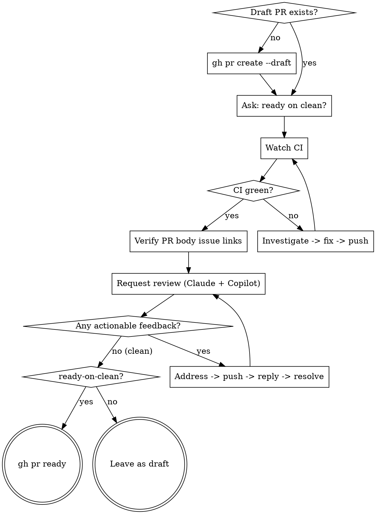

# pr-to-ready

Take a branch of verified commits to a reviewed PR: open the draft PR if it isn't there yet, then loop until CI passes and the review is clean, and finally either flip it to **ready** or leave it as **draft**, per the user's up-front choice.

Precondition: a branch whose commits are already verified — in the Change workflow, `implement-work` hands one over after its completion gate comes back clean. A PR need not exist yet; this skill owns creating it.

## Step 0: Set up the run

Two things, before the loop starts.

### 0-1. Create the draft PR if none exists

`gh pr view --json number,isDraft` reports a PR already tied to the branch — note its `isDraft`. A non-zero exit does **not** by itself mean there is none: auth, network, and repo-context failures look the same as absence, and the message wording varies by `gh` version, so don't key off either. Treat the failure as "couldn't tell" and confirm absence explicitly:

```bash
gh pr view --json number,isDraft                              # existing PR? note isDraft
gh pr list --head <branch> --json number,isDraft              # confirm absence
```

Create only when the list comes back empty. The base comes from the branch itself, not from a fresh look at the issue: `implement-work` records a non-default base as a trailer when it cuts the branch, so read that back rather than deriving it again — the relation it decided from can move between then and now.

```bash
default=$(git symbolic-ref --short refs/remotes/origin/HEAD 2>/dev/null) ||
  default=$(gh repo view --json defaultBranchRef --jq '"origin/" + .defaultBranchRef.name')
[ -n "$default" ] || exit 1   # neither resolved — stop, don't guess a branch name
base=$(git log "$default"..HEAD --format='%(trailers:key=Base-Branch,valueonly)' | grep -m1 . || true)
# a recorded base that is no longer on the remote is finished with: fall back to the default
[ -z "$base" ] || git ls-remote --exit-code --heads origin "$base" >/dev/null 2>&1 || base=""
```

The emptiness test on `default` is what stops an unresolved default, and it is not optional: `git log ..HEAD` is a *valid* empty range that exits 0 and prints nothing, so without it a correctly-stacked task silently reads as unstacked. `refs/remotes/origin/HEAD` is unset often enough to matter — it lives at the repository level, and a hand-built remote never gets it. The `origin/` prefix is built **inside** the `jq` expression rather than prepended outside it, so that a failing `gh` leaves `default` genuinely empty; prepending outside would yield the string `origin/`, which is non-empty and would sail straight past the test.

Newest match wins — a stack deeper than one carries an earlier task's trailer further back, and the nearer one is reached first. `grep` finding nothing is the ordinary unstacked case, so it must not read as an error: `|| true` is load-bearing, because `grep -m1 .` exits non-zero on no match and that would abort the whole flow under `set -e` — which the scripts this skill ships do use. With it, `base` is simply empty.

Between them, the trailer read and the `ls-remote` line leave `base` in exactly one of three states:

- **empty because no trailer was recorded** → no `--base` at all; let GitHub default. This is the ordinary unstacked case, and the absence of a trailer is what says so.
- **set, and still on the remote** → base the PR on it. This is the live stack.
- **emptied by the `ls-remote` check** → the recorded prerequisite branch is gone, so fall back to the default too. It has to be cleared rather than merely noted, or the deleted branch would go straight into the command below.

`${base:+...}` adds the flag only when `base` is non-empty, so one command covers all three outcomes:

```bash
gh pr create --draft ${base:+--base "$base"} --title <title> --body-file <file>
```

That is the whole rule — don't build compensation on top of it. A stacked PR's sub-issue stays open when that PR merges into its prerequisite's branch, because a closing keyword only fires on a merge into the default branch. Leave it open: the work genuinely isn't done until it reaches the default branch, so the open issue is accurate rather than a gap, and closing it is a person's call.

If the list is non-empty but `gh pr view` failed, surface that error and stop — never open a second PR on top of one you couldn't see.

Title and body in **standard Japanese** (標準語, never dialect), following the repo's PR template when it has one. The body must carry the issue links Step 2-0 verifies — a closing keyword (`fixes`/`closes`/`resolves`) on the issue this work resolves, fully qualified as `owner/repo#NNN` when that issue lives in another repository. Getting this right at creation is cheaper than correcting it in 2-0.

Draft, not ready: the whole point of the loop below is that CI and review run before the PR is presented as finished. If a PR already exists but is not a draft, don't convert it — say so and continue; someone chose that deliberately. Record that it came in non-draft: Step 3 has nothing to flip in that case.

Whichever path you took — found or just created — record the PR number and branch before moving on. Every later step takes them as `<PR>` and `<branch>`, and on a first-time run nothing else has bound them yet:

```bash
gh pr view --json number,headRefName --jq '"PR=\(.number) branch=\(.headRefName)"'
```

### 0-2. Ask whether to mark ready on clean

Ask the user: once CI is green and review feedback is clean, should this skill run `gh pr ready` (ready) or leave the PR as draft (draft)? Record the answer as the **ready-on-clean** flag — fixed for the rest of the run, not re-asked mid-loop. Step 3 branches on this flag.

## Overall flow


```dot
digraph pr_to_ready {
  "Draft PR exists?" [shape=diamond];
  "gh pr create --draft" [shape=box];
  "Ask: ready on clean?" [shape=box];
  "Watch CI" [shape=box];
  "CI green?" [shape=diamond];
  "Investigate -> fix -> push" [shape=box];
  "Verify PR body issue links" [shape=box];
  "Request review (Claude + Copilot)" [shape=box];
  "Any actionable feedback?" [shape=diamond];
  "Address -> push -> reply -> resolve" [shape=box];
  "ready-on-clean?" [shape=diamond];
  "gh pr ready" [shape=doublecircle];
  "Leave as draft" [shape=doublecircle];

  "Draft PR exists?" -> "gh pr create --draft" [label="no"];
  "gh pr create --draft" -> "Ask: ready on clean?";
  "Draft PR exists?" -> "Ask: ready on clean?" [label="yes"];
  "Ask: ready on clean?" -> "Watch CI";
  "Watch CI" -> "CI green?";
  "CI green?" -> "Investigate -> fix -> push" [label="no"];
  "Investigate -> fix -> push" -> "Watch CI";
  "CI green?" -> "Verify PR body issue links" [label="yes"];
  "Verify PR body issue links" -> "Request review (Claude + Copilot)";
  "Request review (Claude + Copilot)" -> "Any actionable feedback?";
  "Any actionable feedback?" -> "Address -> push -> reply -> resolve" [label="yes"];
  "Address -> push -> reply -> resolve" -> "Request review (Claude + Copilot)";
  "Any actionable feedback?" -> "ready-on-clean?" [label="no (clean)"];
  "ready-on-clean?" -> "gh pr ready" [label="yes"];
  "ready-on-clean?" -> "Leave as draft" [label="no"];
}
```

## Orchestration model (subagents)

Run this skill as an **orchestrator**. The main loop owns control flow, all decisions, and every state-mutating action; it delegates only self-contained, context-heavy work to subagents. The steps form a dependency chain (a loop), so they run **sequentially** — do not try to run different steps in parallel. Parallelism exists at exactly one point: evaluating independent review findings (2-3).

**Keep in the main loop — never delegate:**
- clean judgment & stop conditions (Step 2 stop conditions)
- code fixes that touch the worktree, and `git commit` / `git push`
- `gh pr comment`, thread replies, thread resolve, `gh pr ready`

**Delegate to a subagent** (it returns findings only, keeping the orchestrator's context lean; each is detailed in its step):
- **CI-failure diagnosis** (Step 1).
- **Review-comment collection** (Step 2-3).
- **Per-finding evaluation, fan-out** (Step 2-3) — one subagent per finding, launched together; genuine parallelism, since findings are independent.

Subagents only investigate and propose (read-only, advisory, no worktree); the orchestrator applies the change, commits, and pushes.

## Making fixes

Every fix in this loop — for a CI failure (Step 1) or accepted review feedback (Step 2-3) — is an ordinary code change: implement → verify → simplify → review your own diff, applying `implement-work`'s implementation discipline. Do **not** re-enter the workflow that got here — don't go back to `plan-work`, and don't re-run `implement-work`'s completion gate: that gate ends by handing off to this skill, so re-entering it from here would loop. This skill's own loop is the PR-phase completion path.

## Step 1: Get CI clean

1. Watch with `gh pr checks <PR> --watch`. If every check passes, go to Step 2.
2. On any failure:
   - Identify the failed run: `gh run list --branch <branch> --limit 5`
   - **Delegate diagnosis to a subagent**: give it `<run-id>` and have it run `gh run view <run-id> --log-failed`, apply **superpowers:systematic-debugging**, and return *only* the root cause + a concrete fix plan (not the raw logs). This keeps the log dump out of the orchestrator's context.
   - Apply the fix in the orchestrator, per *Making fixes* above.
   - commit → push (follow the git rules in the shared AI guidelines; never push directly to master/main)
   - Go back to 1.

**Clean = every check in `gh pr checks` passes.** If even one is fail/pending, keep looping.

## Step 2: Request review, then loop on feedback

Request review from **both Claude and Copilot** when both are available — they catch different things (Copilot catches bugs Claude misses). Skip whichever isn't available; if neither is, still run 2-0 (the PR body is worth verifying regardless of reviewers), then skip the request/wait (2-1, 2-2, 2-3) and go to Step 3.

### 2-0. Verify PR body issue links

Before requesting reviewers, verify that every issue link in the PR body points to the intended repository. This matters because a bare `#NNN` always resolves in the PR's repository, but the target issue may live in a different repository.

1. Read the PR body and the repository the PR lives in:
   ```bash
   gh pr view <PR> --json body,url
   ```
   Take the repository from `url` (`https://github.com/<owner>/<repo>/pull/<PR>`) — a PR always lives in its base repository, which is the one a bare `#NNN` resolves in. There is no `baseRepository` field on `gh pr view`, and don't substitute `gh repo view`: it resolves the current directory's remote, which is the fork rather than the upstream when you're working from a fork clone.
2. Inspect every issue reference in the body, especially references using closing keywords (`resolves`, `fixes`, `closes`). For each reference, determine the repository GitHub will link to:
   - Bare `#NNN` resolves to the PR repository from `url`.
   - Fully qualified `owner/repo#NNN` resolves to that explicit repository.
3. Verify the resolved issue is the intended issue:
   ```bash
   gh issue view <number> --repo <owner/repo> --json url,title,state
   ```
   Compare the resolved repository and issue title with the task context, branch name, commit messages, PR title/body, or linked planning issue. If the intended issue repository is ambiguous, ask the user before requesting review.
4. If any issue link points to the wrong repository, update the PR body before continuing:
   - Same-repository issue: bare `#NNN` is allowed.
   - Cross-repository issue: use the fully qualified `owner/repo#NNN` form.
   - If the PR body says it resolves an issue, keep the closing keyword even for cross-repo targets, e.g. `resolves owner/repo#NNN`.
   - Use `gh pr edit <PR> --body-file <file>` or equivalent to apply the corrected body.

### 2-1. Request the reviewers

- **Claude**: check for an `@claude` trigger in the repo's workflows.
  ```bash
  grep -rl '@claude' .github/workflows/ 2>/dev/null || true
  ```
  If found, post a request comment. Write it in **standard Japanese** with a short "特に見てほしいポイント" list; on a re-request after a new push, include the current HEAD SHA so the review targets the latest state:
  ```bash
  gh pr comment <PR> --body "@claude このPRのレビューをお願いします🙏

  特に見てほしいポイント:
  - <観点1>
  - <観点2>"
  ```
- **Copilot**: try the reviewer flag first, then fall back to the REST endpoint (the bot IS reachable). **Don't chain them with `||`**: the flag can exit 0 and print the PR URL while adding nobody, so its exit status proves nothing and the fallback would never fire. Test what actually landed instead — and read it over REST, because `gh pr view --json reviewRequests` omits bots entirely and reports 0 even while Copilot is requested:
  ```bash
  # prints the count; a non-zero exit means the API call itself failed, which is not "none requested"
  requested() { gh api "repos/<owner>/<repo>/pulls/<PR>" \
                  --jq '[.requested_reviewers[].login | ascii_downcase | select(contains("copilot"))] | length'; }
  gh pr edit <PR> --add-reviewer "@copilot" >/dev/null 2>&1 || true
  n=$(requested) || { echo "cannot read requested reviewers — stop rather than guess"; exit 1; }
  if [ "$n" -eq 0 ]; then
    gh api --method POST "repos/<owner>/<repo>/pulls/<PR>/requested_reviewers" \
      -f "reviewers[]=copilot-pull-request-reviewer[bot]"
    n=$(requested) || { echo "cannot read requested reviewers — stop rather than guess"; exit 1; }
  fi
  [ "$n" -gt 0 ] || echo "Copilot unavailable: neither form stuck"
  ```
  Capture the count into `n` rather than testing `$(requested)` inline: a failing `gh` would make the substitution empty, and `[ "" -gt 0 ]` is a syntax error that aborts under `set -e` — and, worse, would otherwise read as "none requested". Distinguishing the two is the point, so an API failure stops with its own message. The **final** check is what decides availability, because the POST can fail on auth or a rate limit; don't infer success from having run it.

### 2-2. Wait for the review (bound the wait)

- **Claude**: only do this if 2-1 found an `@claude` workflow and posted a request comment. Tie completion to the workflow run, don't guess from comment counts. Find the run the request triggered on this branch, then block on it:
  ```bash
  wf=$(basename "$({ grep -rl '@claude' .github/workflows/ 2>/dev/null || true; } | head -1)")
  if [ -z "$wf" ]; then
    echo "no @claude workflow found — skip the Claude wait"
  else
    gh run list --workflow="$wf" --branch <branch> --limit 5 --json databaseId,status,headSha,conclusion
    gh run watch <run-id> --exit-status   # blocks until the run finishes
  fi
  ```
  Then fetch the new comments it left.
- **Copilot**: poll `gh pr view <PR> --json reviews` and **filter by author login** (see the login-variance note below) — wait for a *new* Copilot review submitted after your latest push. **Do not wait for `APPROVED`**: Copilot commonly only ever returns `COMMENTED`, so `APPROVED` may never arrive.
- **Always bound the poll** with an iteration cap + explicit bail-out (e.g. cap ~10–30 min). On timeout, stop and tell the user rather than looping forever.

**Login variance**: bot logins differ across surfaces — Copilot appears as `Copilot` and `copilot-pull-request-reviewer[bot]`; Claude as lowercase `claude`. Match on a substring and confirm the author login; don't attribute by timestamp alone (a human commenting in the same window can be misattributed).

### 2-3. Evaluate and address feedback

**Collect (subagent).** Delegate comment collection to a subagent: it gathers every reviewer comment left after your latest push (Claude + Copilot + any human), dedupes, and returns a structured list of actionable findings — each with `file:line`, the thread/comment id, and a one-line summary. This keeps the raw review text out of the orchestrator.

**Evaluate (fan-out subagents).** Launch **one subagent per finding in a single message** so they run concurrently — findings are independent. Each applies **superpowers:receiving-code-review** to its single finding and returns a verdict:
- `accept` — change warranted, with the proposed fix
- `reject` — push back, with the technical reason
- `needs-user` — genuinely unclear; surface to the user

**Apply (orchestrator, sequential — these mutate shared state):**

1. For each `accept`, fix the code where a change is warranted, per *Making fixes* above.
2. commit → push
3. Reply to each thread (including `reject` threads — explain the pushback). **Standard Japanese only — never Kansai dialect** (a frank, casual tone is fine, but dialect has slipped in before). **Never put `@claude` in a reply or closing comment** — it re-triggers the review workflow. For the reply mechanism see the "GitHub Thread Replies" section of receiving-code-review (`gh api repos/{owner}/{repo}/pulls/{pr}/comments/{id}/replies`).
4. Resolve the threads — batch all threads from this round in one call (script below takes multiple comment IDs).
5. Go back to 2-1 and re-request both reviewers.

List unresolved threads / resolve one or more at once. `<skill-dir>` is wherever your runtime installed this skill (e.g. `~/.claude/skills/pr-to-ready`, `~/.agents/skills/pr-to-ready`):
```bash
<skill-dir>/scripts/list-unresolved-threads.sh <owner> <repo> <PR>
<skill-dir>/scripts/resolve-thread.sh <owner> <repo> <PR> <comment-id> [comment-id...]
```
(GitHub's REST API has no resolve endpoint, so these wrap the GraphQL mutation.)

### Clean judgment & stop conditions

**Clean =**
- Claude leaves only "looks good" / "LGTM"-equivalent comments with no outstanding actionable feedback, AND
- Copilot's latest round produced **no new actionable comments** (not "APPROVED") and there are **zero unresolved threads**.

Treat human reviewer comments the same way (see receiving-code-review).

**Stop the loop when ANY of these holds** (otherwise keep looping):
1. Clean per above.
2. **LGTM-equivalent twice in a row** — even if each round keeps surfacing *fresh optional nits*, once you've gotten two consecutive rounds with no must-fix feedback, stop; endless optional-nit chasing is not required for ready.
3. **Same feedback survives 3+ rounds** of fixes without resolving → stop and ask the user.

## Step 3: Finish, per the ready-on-clean flag

Once the review is clean (or no reviewer was available), branch on the flag recorded in Step 0:

- **ready-on-clean = yes**: take it out of draft — but only when it actually is one. Confirm first, since Step 0-1 lets an already-non-draft PR through:
  ```bash
  gh pr view <PR> --json isDraft --jq '.isDraft'
  gh pr ready <PR>   # only when isDraft is true
  ```
  When it is already ready, skip `gh pr ready` and say so — there is nothing to flip.
  **Note on approval vs LGTM**: Claude's ✅ "LGTM" is a *comment*, not a formal GitHub approval — `reviewDecision` can stay `REVIEW_REQUIRED`. If the repo has branch protection requiring an approving review, un-drafting won't unblock merge; flag this to the user (a human approver may be needed).
- **ready-on-clean = no**: leave the PR as draft. Do not run `gh pr ready`. Report to the user that CI and review are clean and the PR is left as draft per their earlier choice.

### Parent issue, when the work was split into sub-issues

Large work is planned as a parent issue with one sub-issue per PR (`plan-work` owns that split). GitHub does **not** close a parent when its children close, so once this PR merges and closes its sub-issue, check whether it was the last open one:

```bash
gh api repos/{owner}/{repo}/issues/<parent>/sub_issues --jq '.[] | {number, state}'
```

If every child is closed, ask the user whether to close the parent or leave it open with a completion comment (標準語), and do what they choose. If children remain open, say which — the next sub-issue is the next run of `plan-work`'s output through `implement-work`.
