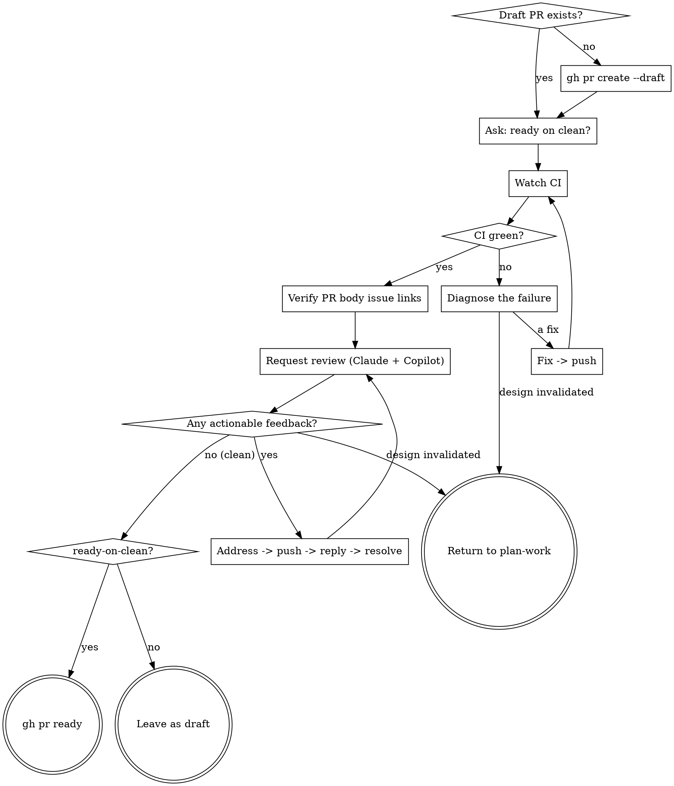

# pr-to-ready

Take a branch of verified commits to a reviewed PR: open the draft PR if it isn't there yet, then loop until CI passes and the review is clean, and finally either flip it to **ready** or leave it as **draft**, per the user's up-front choice.

Precondition: a branch whose commits are already verified — in the Change workflow, `implement-work` hands one over after its completion gate comes back clean — and whose ref exists **on the remote**, since `gh pr create` opens a PR from a remote ref and an unpushed branch has nothing to open one from. An unpushed branch is not a blocker: push it (`git push -u origin <branch>`) rather than stopping. Step 0-1 performs this check once `<branch>` is bound. A PR need not exist yet; this skill owns creating it.

## Step 0: Set up the run

Two things, before the loop starts.

### 0-1. Create the draft PR if none exists

Bind `<branch>` before anything below uses it.

**The primary source is the caller's explicit input**: `implement-work` hands off a named branch, and a user invoking this skill directly names one — take that name as given.

**Reading the current branch is only the fallback**, for a session handed no name:

```bash
git branch --show-current      # empty output = detached HEAD
```

Tested by **output emptiness, not exit status** — it exits 0 and prints nothing on a detached HEAD.

**Two answers from the fallback are refusals, not results**: empty output, and the default branch. Stop and ask which branch to take to a PR rather than proceeding — a session handed no name may be sitting in the main checkout on the default branch, whose HEAD carries none of the task's work, and driving a PR from there would target someone else's branch, or open none at all.

Recognizing the default branch takes a command of its own. Use the same three-rung ladder `review-code`'s **Scope** uses — `symbolic-ref`, then `gh repo view`, then ask — rather than inventing a second answer, with flags suited to this comparison, which needs a bare branch name:

```bash
git symbolic-ref --short refs/remotes/origin/HEAD          # exit 0 prints origin/<default>
gh repo view --json defaultBranchRef --jq '.defaultBranchRef.name'
```

`symbolic-ref` exits 0 and prints `origin/<default>` — strip the `origin/` prefix before comparing it with `<branch>`. A non-zero exit means the remote HEAD is not set in this checkout, **not** that there is no default branch: fall to `gh repo view`, and if that fails too, ask. **Never guess a branch name** — the same rule `review-code` states, for the same reason.

Once `<branch>` is bound, check it exists on the remote:

```bash
git ls-remote --exit-code --heads origin <branch>   # 0 = present, 2 = absent, 128 = failure
```

Exit 0 → go on. Exit 128 is a network or auth failure — surface it and stop, rather than reading it as absence and pushing over something you could not see.

Exit 2 has two remedies, because pushing needs something to push and a session may hold no local ref for a branch it was handed by name:

```bash
git show-ref --verify --quiet refs/heads/<branch>   # 0 = local ref exists, 1 = it does not
```

Exit 0 → push it (`git push -u origin <branch>`) and go on, stopping and reporting if the push itself exits non-zero. Exit 1 → **stop and report**: the branch named exists neither in this checkout nor on the remote, so there is nothing to push and nothing to open a PR from — inventing or creating a branch here would manufacture the very state the precondition asks the caller to bring.

Every command below in this step takes `<branch>` as an argument, which is why it is bound here rather than at the end.

Ask whether a PR is already tied to the branch with `gh pr list --head <branch>`, **not `gh pr view <branch>`**. The reason for that choice, and for how every `gh` result below is tested, is in `<skill-dir>/references/gh-mechanics.md` — `<skill-dir>` being wherever your runtime installed this skill (e.g. `~/.claude/skills/pr-to-ready`, `~/.agents/skills/pr-to-ready`):

```bash
gh pr list --head <branch> --json number,isDraft   # non-empty = a PR exists, note its isDraft; [] = none
```

Test it by **output and exit status together**: exit 0 with `[]` is the only thing that means "no PR", and a non-zero exit is "couldn't tell" rather than "none" — stop on it.

Create only when the list comes back empty. The base comes from the branch itself: `implement-work` records a non-default base as a `Base-Branch:` trailer when it cuts the branch, and this step reads that back rather than deriving it again. The contract, and the reasons behind every test below, are in `<skills-dir>/implement-work/references/base-branch.md` — `<skills-dir>` being the runtime's skills directory, where this skill and `implement-work` sit as siblings.

The scan runs **from the branch tip backwards and takes the first one found** — the tip being `FETCH_HEAD`, not this checkout's `HEAD`:

```bash
git fetch --quiet origin <branch>                                              # 0 = fetched; non-zero = stop, see below
trailers="$(git log --format='%(trailers:key=Base-Branch,valueonly)' FETCH_HEAD)"   # 0 = history read; non-zero = stop
printf '%s\n' "$trailers" | grep -m1 .                                         # 0 = recorded base on stdout, 1 = no trailer
```

When a trailer was found, check whether its branch survives:

```bash
git ls-remote --exit-code --heads origin <recorded>   # 0 = still there, 2 = gone
```

Any other non-zero exit is a failure rather than absence: stop the run.

Exit 1 from the scan lands in the **No trailer** bullet below; scan 0 with `ls-remote` 0 lands in **still on the remote**; scan 0 with `ls-remote` 2 lands in **branch is gone**:

- **No trailer** → omit `--base` and let GitHub choose.
- **A trailer whose branch is still on the remote** → open the PR against that branch, so the diff carries only this task's work.
- **A trailer whose branch is gone** → omit `--base` as well.

```bash
gh pr create --draft --head <branch> --title <title> --body-file <file>                     # no trailer, or its branch is gone
gh pr create --draft --head <branch> --base <recorded> --title <title> --body-file <file>   # trailer's branch still on the remote
```

**`--head <branch>` is not optional here**, whichever line you take: `gh pr create` defaults the head to the *current* branch, and this step exists precisely because `<branch>` may not be the one checked out. Omitting it opens the PR from the wrong head — and the readback below, which filters on `<branch>`, then comes back empty and reports that creation didn't take, when in fact it did and left a stray draft PR behind.

That is the whole rule — don't build compensation on top of it. A stacked PR's sub-issue stays open when that PR merges into its prerequisite's branch, because a closing keyword only fires on a merge into the default branch. Leave it open: the work genuinely isn't done until it reaches the default branch, so the open issue is accurate rather than a gap, and closing it is a person's call.

Title and body in **standard Japanese** (標準語, never dialect), following the repo's PR template when it has one. The body must carry the issue links Step 2-0 verifies — a closing keyword (`fixes`/`closes`/`resolves`) on the issue this work resolves, fully qualified as `owner/repo#NNN` when that issue lives in another repository. Getting this right at creation is cheaper than correcting it in 2-0.

Draft, not ready: the whole point of the loop below is that CI and review run before the PR is presented as finished. If a PR already exists but is not a draft, don't convert it — say so and continue; someone chose that deliberately. Record that it came in non-draft: Step 3 has nothing to flip in that case.

Whichever path you took — found or just created — record the PR number before moving on. `<branch>` is already bound at the top of this step, so this records `<PR>` only; every later step takes both as given, and on a first-time run nothing else has bound `<PR>` yet. As with the existence check above, name `<branch>` explicitly rather than relying on the current checkout:

```bash
gh pr list --head <branch> --json number,isDraft --jq '.[] | "PR=\(.number) draft=\(.isDraft)"'
```

**Print every match with `.[]` and count the lines — never `.[0]`.** `.[]` yields nothing for an empty list and one line per match, which is what makes the four outcomes below distinguishable.

Read exit status and line count together, and stop on three of the four outcomes:

- **non-zero exit** → the query failed, and it prints nothing on stdout, so stop and report *that* — never misreport a failed lookup as a failed creation;
- **exit 0, no lines** → no open PR on the branch, so creation did not take; stop and surface it rather than continuing with `<PR>` unbound;
- **exit 0, exactly one line** → bind `<PR>` from it;
- **exit 0, more than one line** → stop and ask which PR this run should drive. A branch takes one `<PR>` here, so this is a human call.

### 0-2. Ask whether to mark ready on clean

Ask the user: once CI is green and review feedback is clean, should this skill run `gh pr ready` (ready) or leave the PR as draft (draft)? Record the answer as the **ready-on-clean** flag — fixed for the rest of the run, not re-asked mid-loop. Step 3 branches on this flag.

## Overall flow


```dot
digraph pr_to_ready {
  "Draft PR exists?" [shape=diamond];
  "gh pr create --draft" [shape=box];
  "Ask: ready on clean?" [shape=box];
  "Watch CI" [shape=box];
  "CI green?" [shape=diamond];
  "Diagnose the failure" [shape=box];
  "Fix -> push" [shape=box];
  "Verify PR body issue links" [shape=box];
  "Request review (Claude + Copilot)" [shape=box];
  "Any actionable feedback?" [shape=diamond];
  "Address -> push -> reply -> resolve" [shape=box];
  "ready-on-clean?" [shape=diamond];
  "gh pr ready" [shape=doublecircle];
  "Leave as draft" [shape=doublecircle];
  "Return to plan-work" [shape=doublecircle];

  "Draft PR exists?" -> "gh pr create --draft" [label="no"];
  "gh pr create --draft" -> "Ask: ready on clean?";
  "Draft PR exists?" -> "Ask: ready on clean?" [label="yes"];
  "Ask: ready on clean?" -> "Watch CI";
  "Watch CI" -> "CI green?";
  "CI green?" -> "Diagnose the failure" [label="no"];
  "Diagnose the failure" -> "Fix -> push" [label="a fix"];
  "Fix -> push" -> "Watch CI";
  "CI green?" -> "Verify PR body issue links" [label="yes"];
  "Verify PR body issue links" -> "Request review (Claude + Copilot)";
  "Request review (Claude + Copilot)" -> "Any actionable feedback?";
  "Any actionable feedback?" -> "Address -> push -> reply -> resolve" [label="yes"];
  "Address -> push -> reply -> resolve" -> "Request review (Claude + Copilot)";
  "Any actionable feedback?" -> "ready-on-clean?" [label="no (clean)"];
  "Any actionable feedback?" -> "Return to plan-work" [label="design invalidated"];
  "Diagnose the failure" -> "Return to plan-work" [label="design invalidated"];
  "ready-on-clean?" -> "gh pr ready" [label="yes"];
  "ready-on-clean?" -> "Leave as draft" [label="no"];
}
```

## Orchestration model

Run this skill as an **orchestrator**. The main loop owns control flow, all decisions, and every state-mutating action; it delegates only self-contained, context-heavy work to subagents. The steps form a dependency chain (a loop), so they run **sequentially** — do not try to run different steps in parallel. Parallelism exists at exactly one point: evaluating independent review findings (2-3).

**Keep in the main loop — never delegate:**
- clean judgment & stop conditions (Step 2 stop conditions)
- code fixes that touch the worktree, and `git commit` / `git push`
- `gh pr comment`, thread replies, thread resolve, `gh pr ready`

**Delegate to a subagent** (it returns findings only, keeping the orchestrator's context lean; each is detailed in its step):
- **CI-failure diagnosis** (Step 1).
- **Review-comment collection** (Step 2-3).
- **Per-finding evaluation, fan-out** (Step 2-3) — one subagent per finding, launched together; genuine parallelism, since findings are independent.

Subagents only investigate and propose (read-only, advisory, no worktree); the orchestrator applies the change, commits, and pushes.

## Making fixes

Every fix in this loop — for a CI failure (Step 1) or accepted review feedback (Step 2-3) — is an ordinary code change: implement, verify, simplify with `simplify-code`, and review your own diff with `review-code`, applying `implement-work`'s implementation discipline. Running those two skills is not re-entering anything: what the prohibition below forbids is re-entering `implement-work`'s completion **gate** — the loop that decides when the work is done — not the individual skills that gate happens to call. This skill's own loop is the PR-phase completion path, so an ordinary fix finishes here rather than by re-entering the workflow that got here.

**Before applying any fix, check that it is one.** A review finding — or a CI diagnosis — showing that the agreed design is itself what's wrong is not a fix waiting to be applied. Take **Escalation** instead.

This check sits here rather than in either loop because both reach the exit through this section: Step 2's stop conditions carry the trigger, because a loop needs a condition to stop on, and Step 1 has no equivalent list at all.

The two prohibitions that follow from that are **not equally absolute**, and collapsing them into one is how that exit gets lost:

- **`implement-work`'s completion gate — never re-run it**, no exception. That gate ends by handing off to this skill, so re-entering it from here would loop.
- **`plan-work` — don't go back for an ordinary fix.** A finding that invalidates the agreed design is the exception, because this loop cannot absorb it: per the check above, it is not a fix at all.

## Step 1: Get CI clean

1. Watch with `gh pr checks <PR> --watch`. If every check passes, go to Step 2.
2. On any failure:
   - Identify the failed run: `gh run list --branch <branch> --limit 5`
   - **Delegate diagnosis to a subagent**: give it `<run-id>` and have it run `gh run view <run-id> --log-failed`, apply **superpowers:systematic-debugging**, and return *only* the root cause + a concrete fix plan (not the raw logs). This keeps the log dump out of the orchestrator's context.
   - Apply the fix in the orchestrator, per *Making fixes* above.
   - commit → push (follow the git rules in the shared AI guidelines; never push directly to master/main)
   - Go back to 1.

**Clean = every check in `gh pr checks` passes.** If even one is fail/pending, keep looping.

## Step 2: Request review, then loop on feedback

Request review from **both Claude and Copilot** when both are available — they catch different things (Copilot catches bugs Claude misses). Skip whichever isn't available; if neither is, still run 2-0 (the PR body is worth verifying regardless of reviewers), then skip the request/wait (2-1, 2-2, 2-3) and go to Step 3.

### 2-0. Verify PR body issue links

This step confirms the PR body already follows the shared AI guidelines' **Git & PR workflow** rule on cross-repo references, before reviewers are asked to read it.

1. Read the body and the repository the PR lives in:
   ```bash
   gh pr view <PR> --json body,url
   ```
   Take the repository from `url` (`https://github.com/<owner>/<repo>/pull/<PR>`) — a PR always lives in its base repository, which is the one a bare `#NNN` resolves in. There is no `baseRepository` field on `gh pr view`, and don't substitute `gh repo view`: it resolves the current directory's remote, which is the fork rather than the upstream when you're working from a fork clone.
2. For every issue reference in the body, resolve which repository GitHub will link to — a bare `#NNN` to the PR's own, `owner/repo#NNN` to the explicit one — then confirm it is the intended issue:
   ```bash
   gh issue view <number> --repo <owner/repo> --json url,title,state
   ```
   Compare the resolved repository and title against the task context: branch name, commit messages, PR title, or the linked planning issue. **Ask the user when the intended repository is ambiguous** rather than guessing.
3. Correct any wrong link before continuing: `gh pr edit <PR> --body-file <file>`.

### 2-1. Request the reviewers

- **Claude**: check for an `@claude` trigger in the repo's workflows.
  ```bash
  grep -rl '@claude' .github/workflows/ 2>/dev/null || true
  ```
  If found, post a request comment. Write it in **standard Japanese** with a short "特に見てほしいポイント" list; on a re-request after a new push, include the current HEAD SHA so the review targets the latest state:
  ```bash
  gh pr comment <PR> --body "@claude このPRのレビューをお願いします🙏

  特に見てほしいポイント:
  - <観点1>
  - <観点2>"
  ```
- **Copilot**: try the reviewer flag, then fall back to the REST endpoint (the bot IS reachable):
  ```bash
  gh pr edit <PR> --add-reviewer "@copilot"                     # first choice
  gh api --method POST "repos/<owner>/<repo>/pulls/<PR>/requested_reviewers" \
    -f "reviewers[]=copilot-pull-request-reviewer[bot]"         # only when the readback shows the flag didn't take
  ```
  These are alternatives, not a sequence. **Don't judge either by its exit status, and don't chain them with `||`** — the flag can exit 0 while adding nobody. Read back who is actually requested after each attempt, over REST (`gh pr view --json reviewRequests` omits bots and cannot answer this), and run the REST form only when the flag didn't take. Treat Copilot as unavailable only when it is still absent after the REST form; failing to *read* the reviewers stops the run instead. Why each of these is the only test that works: `<skill-dir>/references/gh-mechanics.md`.

### 2-2. Wait for the review (bound the wait)

- **Claude**: only do this if 2-1 found an `@claude` workflow and posted a request comment. Tie completion to the workflow run, don't guess from comment counts — list the runs, match one to your own push by `headSha`, then block on it:
  ```bash
  <skill-dir>/scripts/watch-claude-review.sh <branch>            # 0 = runs printed as JSON, 1 = no @claude workflow
  <skill-dir>/scripts/watch-claude-review.sh <branch> <run-id>   # blocks; 0 = run finished
  ```
  Then fetch the new comments it left.
- **Copilot**: poll `gh pr view <PR> --json reviews` and **filter by author login** (see the login-variance note below) — wait for a *new* Copilot review submitted after your latest push. **Do not wait for `APPROVED`**: Copilot commonly only ever returns `COMMENTED`, so `APPROVED` may never arrive.
- **Always bound the poll** with an iteration cap + explicit bail-out (e.g. cap ~10–30 min). On timeout, stop and tell the user rather than looping forever.

**Login variance**: match a substring of the author login — Copilot appears as `Copilot` and as `copilot-pull-request-reviewer[bot]`, Claude as lowercase `claude` — and never attribute by timestamp alone.

### 2-3. Evaluate and address feedback

**Collect (subagent).** Delegate comment collection to a subagent: it gathers every reviewer comment left after your latest push (Claude + Copilot + any human), dedupes, and returns a structured list of actionable findings — each with `file:line`, the thread/comment id, and a one-line summary. This keeps the raw review text out of the orchestrator.

**Evaluate (fan-out subagents).** Launch **one subagent per finding in a single message** so they run concurrently — findings are independent. Each applies **superpowers:receiving-code-review** to its single finding and returns a verdict:
- `accept` — change warranted, with the proposed fix
- `reject` — push back, with the technical reason
- `needs-user` — genuinely unclear; surface to the user

**Apply (orchestrator, sequential — these mutate shared state):**

1. For each `accept`, fix the code where a change is warranted, per *Making fixes* above.
2. commit → push
3. Reply to each thread (including `reject` threads — explain the pushback). **Standard Japanese only — never Kansai dialect** (a frank, casual tone is fine, but dialect has slipped in before). **Never put `@claude` in a reply or closing comment** — it re-triggers the review workflow. For the reply mechanism see the "GitHub Thread Replies" section of receiving-code-review (`gh api repos/{owner}/{repo}/pulls/{pr}/comments/{id}/replies`).
4. Resolve the threads — batch all threads from this round in one call (script below takes multiple comment IDs).
5. Go back to 2-1 and re-request both reviewers.

List unresolved threads / resolve one or more at once:
```bash
<skill-dir>/scripts/list-unresolved-threads.sh <owner> <repo> <PR>
<skill-dir>/scripts/resolve-thread.sh <owner> <repo> <PR> <comment-id> [comment-id...]
```
(GitHub's REST API has no resolve endpoint, so these wrap the GraphQL mutation.)

### Clean judgment & stop conditions

**Clean =**
- Claude leaves only "looks good" / "LGTM"-equivalent comments with no outstanding actionable feedback, AND
- Copilot's latest round produced **no new actionable comments** (not "APPROVED") and there are **zero unresolved threads**.

Treat human reviewer comments the same way (see receiving-code-review).

**Stop the loop when any of these holds** — read them **in order** and take the first that applies, not as an unordered set: two can hold at once, and then only one of their remedies is right (otherwise keep looping).

1. Clean per above.
2. **A finding invalidates the agreed design** → stop and take **Escalation**. Don't fix it here, and don't carry it into another round. Check this on **every** round, before 3 and 4: such a finding can also satisfy 4, and 4's remedy — handing the disagreement to the user — is the wrong one for a design that needs re-approving.
3. **LGTM-equivalent twice in a row** — even if each round keeps surfacing *fresh optional nits*, once you've gotten two consecutive rounds with no must-fix feedback, stop; endless optional-nit chasing is not required for ready.
4. **Same feedback survives 3+ rounds** of fixes without resolving → stop and ask the user.

## Step 3: Finish, per the ready-on-clean flag

Once the review is clean (or no reviewer was available), branch on the flag recorded in Step 0:

- **ready-on-clean = yes**: take it out of draft — but only when it actually is one. Confirm first, since Step 0-1 lets an already-non-draft PR through:
  ```bash
  gh pr view <PR> --json isDraft --jq '.isDraft'
  gh pr ready <PR>   # only when isDraft is true
  ```
  When it is already ready, skip `gh pr ready` and say so — there is nothing to flip.
  **Note on approval vs LGTM**: Claude's ✅ "LGTM" is a *comment*, not a formal GitHub approval — `reviewDecision` can stay `REVIEW_REQUIRED`. If the repo has branch protection requiring an approving review, un-drafting won't unblock merge; flag this to the user (a human approver may be needed).
- **ready-on-clean = no**: leave the PR as draft. Do not run `gh pr ready`. Report to the user that CI and review are clean and the PR is left as draft per their earlier choice.

Either way, **this run ends here.** The flow has two terminal states, **ready** and **draft** — the same two the flow diagram ends on — and reaching one is this flow's completion, not a pause partway through something longer. Everything that depends on the merge belongs to a person, because the merge itself does: what follows is what this run hands them.

### What this run hands back

Nothing that depends on the merge can be a step here. Report these as the run's closing hand-over, and act on none of them:

- **The parent issue, whenever one backs this PR's sub-issue.** `plan-work` plans a tracked change as a parent issue with one sub-issue per PR, and GitHub does **not** close a parent when its children close — so a decision about the parent comes due on that merge, not before. Hand over the material for it rather than the decision:

  ```bash
  gh api repos/{owner}/{repo}/issues/<parent>/sub_issues --jq '.[] | {number, state}'
  ```

  Read that as of now and say so: this PR's own sub-issue still shows open, because the merge that closes it hasn't happened yet. If it is the last one open, the parent becomes closable on that merge — report that, and leave it. Closing an issue is a person's call, whoever is counting.
- **The worktree and the branch.** Both outlive this run and nothing here removes them: the PR is open, so the branch is still needed, and PR feedback gets fixed in that worktree. Name both, so neither becomes litter nobody can identify later.
- **The next sub-issue, when children remain open.** Say which one is next. It is a fresh run of `implement-work` over `plan-work`'s output — from that flow's own entry, not a continuation of this one.

**Don't start any of it.** Reaching **ready** or **draft** ended the run, and carrying on into the next sub-issue would do a fresh `implement-work`'s worth of work with none of its gates. The single exception is an explicit instruction already in the chat covering what comes after this PR. Even then **this run still ends here**: what such an instruction licenses is *starting* the next run — from its own flow's entry and through every one of its gates — not extending this one past its terminus. Follow it, because the user has said what happens next rather than leaving it to be inferred.

## Escalation

The rule is the shared AI guidelines' **Escalation**, and the PR phase is not an exception to it. The loop's stop conditions carry the trigger; this section says what leaving with it hands over.

Hand `plan-work`'s entry for a re-approval the three things it asks for:

- **the finding** — what it showed, and which part of the agreed design it undoes;
- **the branch name**;
- **the branch's state** — whether it is pushed, and the `<PR>` this run was driving.

Add where the review had got to: the round the finding surfaced on, and the findings already fixed and pushed. Re-approval is judged against the branch as it now stands, not as it was handed over.

Leave the PR as it is. Don't close it, and don't change its draft state: whether that branch is reused or discarded is `plan-work`'s call, and closing a PR is a person's. Report that it is still open and that its draft state is unchanged, so neither is mistaken for done.
